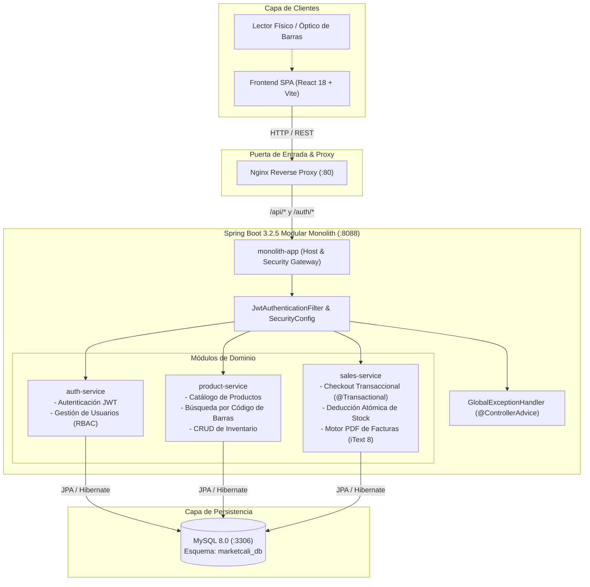
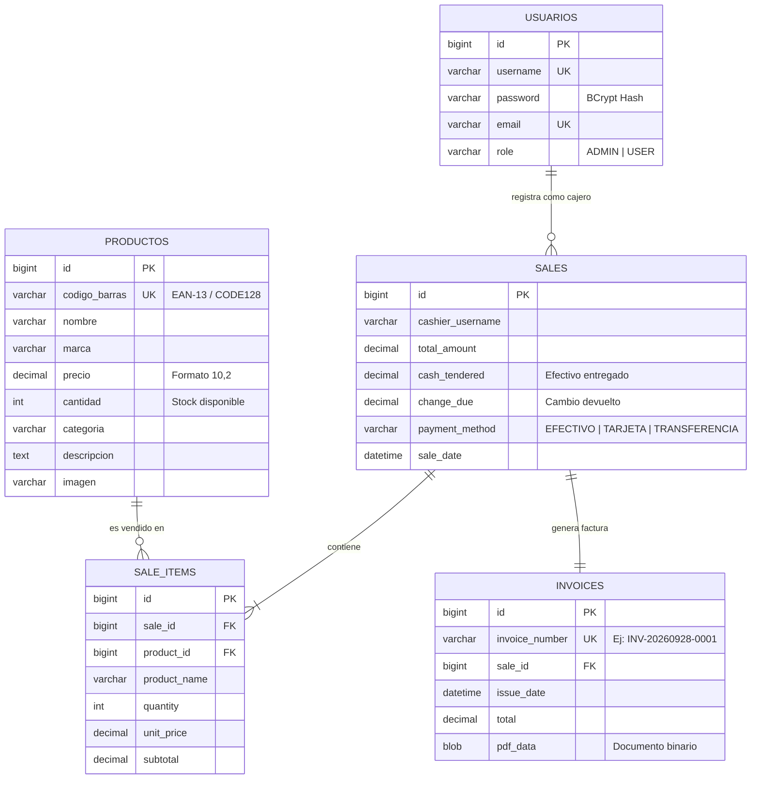

# ⚡ NexPOS - Backend System (Modular Monolith)

[](https://www.oracle.com/java/)
[](https://spring.io/projects/spring-boot)
[](http://localhost/swagger-ui/index.html)
[](https://flywaydb.org/)
[](https://www.mysql.com/)
[](https://www.docker.com/)
[](https://www.terraform.io/)
[](LICENSE)

**NexPOS Backend** es el motor transaccional de punto de venta (POS) y gestión comercial multirrubro (supermercados, droguerías, ferreterías, tiendas de conveniencia y retail general). Diseñado bajo el patrón arquitectónico de **Monolito Modular**, combina la cohesión de dominios de negocio desacoplados con la simplicidad de despliegue, monitoreo y mantenimiento de un único artefacto de ejecución.

> 📚 **Documentación Estratégica Completa:**
> - [📘 Guía Maestra del Ciclo de Vida de Desarrollo de Software (SDLC)](docs/SDLC_GUIDE.md)
> - [🚀 Visión Comercial, Hoja de Ruta & Cumplimiento DIAN](docs/COMMERCIAL_ROADMAP.md)
> - [🧪 Swagger UI Interactivo (API Viva)](http://localhost/swagger-ui/index.html)
> - [🩺 Estado del Sistema en Vivo (Actuator Health)](http://localhost/actuator/health)

---

## 📑 Tabla de Contenidos

- [Visión General & Valor de Negocio](#-visión-general--valor-de-negocio)
- [Arquitectura del Sistema](#-arquitectura-del-sistema)
- [Estructura del Proyecto y Módulos](#-estructura-del-proyecto-y-módulos)
- [Migraciones de Base de Datos con Flyway](#-migraciones-de-base-de-datos-con-flyway)
- [Modelado de Datos & Base de Datos](#-modelado-de-datos--base-de-datos)
- [Documentación Interactiva Swagger / OpenAPI 3](#-documentación-interactiva-swagger--openapi-3)
- [Referencia Completa de la API REST](#-referencia-completa-de-la-api-rest)
- [Instalación y Puesta en Marcha](#-instalación-y-puesta-en-marcha)
  - [Opción 1: Docker Compose (Recomendado)](#opción-1-docker-compose-recomendado)
  - [Opción 2: Entorno Local de Desarrollo](#opción-2-entorno-local-de-desarrollo)
- [Variables de Entorno y Configuración](#-variables-de-entorno-y-configuración)
- [Seguridad & Control de Acceso (RBAC)](#-seguridad--control-de-acceso-rbac)
- [Salud, Métricas y Monitoreo (Actuator)](#-salud-métricas-y-monitoreo-actuator)
- [Pruebas Automatizadas y Calidad](#-pruebas-automatizadas-y-calidad)
- [Despliegue Cloud en Azure con Terraform](#-despliegue-cloud-en-azure-con-terraform)
- [Roadmap Comercial](#-roadmap-comercial)

---

## 💡 Visión General & Valor de Negocio

El sistema resuelve las necesidades críticas de un supermercado retail:
1. **Control de Inventario en Tiempo Real**: Evita la rotura de stock mediante validaciones transaccionales y deducciones atómicas en cada checkout.
2. **Alta Velocidad en Punto de Venta (POS)**: Búsqueda indexada por código de barras (EAN-13, CODE128) con respuestas inferiores a 50ms.
3. **Facturación Transaccional y Comprobantes PDF**: Generación inmediata de tiquetes de venta estructurados con desglose de ítems, cálculo de cambio y métodos de pago mixtos.
4. **Seguridad y Trazabilidad**: Autenticación Bearer JWT con roles diferenciados (`ADMIN`, `USER`) y auditoría de ventas por usuario cajero.

---

## 🏛️ Arquitectura del Sistema

El backend está concebido como un **Monolito Modular** estructurado en módulos Maven independientes. Esto garantiza fronteras de dominio estrictas y permite una eventual migración a microservicios si la escala de negocio lo requiere, sin incurrir en la sobrecarga operacional prematura.



### Componentes de la Solución

| Componente | Contenedor / Servicio | Puerto Interno | Puerto Host | Descripción |
| :--- | :--- | :--- | :--- | :--- |
| **Frontend Nginx** | `frontend` | `80` | `80` | Sirve la SPA de React y reenvía tráfico `/api/*` y `/auth/*` al backend. |
| **Monolith App** | `monolith-app` | `8088` | `8088` | Servidor embebido Apache Tomcat con la aplicación Spring Boot unificada. |
| **MySQL Database** | `mysql-db` | `3306` | `3307` | Base de datos relacional MySQL 8.0 con datos iniciales semillados. |

---

## 📂 Estructura del Proyecto y Módulos

El repositorio sigue las directrices oficiales de Maven para proyectos multi-módulo:

```
nexpos-backend/
├── pom.xml                                  # POM raíz: Dependency Management, plugins y módulos
├── docker-compose.yml                       # Orquestador local multicontenedor
├── docker/
│   └── mysql/init/01-schema.sql             # Script SQL de inicialización automática
├── terraform/                               # Infraestructura como Código (IaC) para Azure
│   ├── main.tf, aca.tf, acr.tf, mysql.tf    # Configuración de Container Apps, ACR y MySQL
│   └── variables.tf, outputs.tf             # Parámetros y salidas cloud
│
├── monolith-app/                            # 🚀 MÓDULO HOST (Orquestador Spring Boot)
│   ├── pom.xml                              # Declara dependencias de auth, product y sales
│   ├── Dockerfile                           # Build multietapa (Maven 3.9 -> Eclipse Temurin JRE)
│   └── src/main/
│       ├── java/miguel/monolith/
│       │   ├── MarketcaliMonolithApplication.java # Entry point con @EntityScan y @EnableJpaRepositories
│       │   ├── config/                      # Configuración de Spring Security, CORS y Beans
│       │   └── exception/                   # GlobalExceptionHandler (@ControllerAdvice centralizado)
│       └── resources/
│           └── application.yml              # Perfiles 'dev' y 'docker', Datasource y Secretos
│
├── auth-service/                            # 🔐 DOMINIO: Autenticación & Usuarios
│   ├── pom.xml
│   └── src/main/java/miguel/auth/
│       ├── bootstrap/AdminDataInitializer.java # Creación del superusuario inicial
│       ├── controller/                      # AuthController (/auth/*) y UserController (/api/users/*)
│       ├── dto/                             # LoginRequest, AuthResponse
│       ├── model/Usuario.java               # Entidad de usuario y roles (ADMIN, USER)
│       ├── repository/UsuarioRepository.java# Consultas JPA de credenciales
│       ├── security/JwtProvider.java        # Firma y validación criptográfica de tokens JWT
│       └── service/AuthService.java         # Hashing con BCrypt y lógica de sesión
│
├── product-service/                         # 📦 DOMINIO: Catálogo & Inventario
│   ├── pom.xml
│   └── src/main/java/miguel/product/
│       ├── bootstrap/ProductDataInitializer.java # Semillado de 10 productos típicos de supermercado
│       ├── controller/ProductoController.java # Endpoints /api/productos (búsqueda, scanner, CRUD)
│       ├── dto/ProductoDTO.java             # Objeto de transferencia de datos validado
│       ├── model/Producto.java              # Entidad con control de stock, precio y código de barras
│       ├── repository/ProductoRepository.java # Consultas por ID y código de barras exacto
│       └── service/ProductoService.java     # Lógica de actualización de inventario
│
└── sales-service/                           # 💰 DOMINIO: Ventas, Facturación & Caja POS
    ├── pom.xml
    ├── src/main/java/miguel/sales/
    │   ├── controller/SaleController.java   # Endpoints /api/sales (checkout, historial, descarga PDF)
    │   ├── dto/                             # SaleRequest, SaleItemRequest
    │   ├── model/                           # Sale (encabezado), SaleItem (detalle), Invoice (factura)
    │   ├── repository/                      # Repositorios JPA transaccionales
    │   └── service/
    │       ├── SaleService.java             # Validación de stock atómica y registro de compra
    │       └── PdfService.java              # Renderizado de tiquetes térmicos en PDF con iText 8
    └── src/test/java/miguel/sales/
        └── service/PdfServiceTest.java      # Pruebas unitarias de emisión de comprobantes
```

---

## 🗃️ Migraciones de Base de Datos con Flyway

El backend gestiona la evolución del esquema relacional mediante **Flyway**, garantizando migraciones deterministas y consistentes entre entornos:

- **`V1__initial_schema.sql`**: Definición DDL normalizada de las tablas de negocio (`usuarios`, `productos`, `sales`, `sale_items`, `invoices`) con restricciones de integridad referencial.
- **`V2__add_performance_indexes.sql`**: Índices B-Tree optimizados para el escáner de códigos de barra (`idx_productos_codigo_barras`), consultas cronológicas de ventas (`idx_sales_sale_date`) y búsqueda de comprobantes (`idx_invoices_number`).

Al inicializar la aplicación, Spring Boot aplica automáticamente los scripts pendientes y mantiene la tabla de auditoría `flyway_schema_history`.

---

## 🗄️ Modelado de Datos & Base de Datos

El sistema utiliza un esquema relacional normalizado alojado en la base de datos `marketcali_db`.



### Datos de Inicialización Automática (Seeding)

Al arrancar por primera vez, el sistema inyecta automáticamente:
- **Usuario Administrador**:
  - Usuario: `admin`
  - Contraseña: `admin`
  - Rol: `ADMIN`
- **Catálogo de Productos Inicial**: 10 productos con códigos de barra válidos (Arroz Diana, Leche Alquería, Aceite Premier, Café Sello Rojo, etc.) listos para probar el escáner POS de inmediato.

---

## 🧪 Documentación Interactiva Swagger / OpenAPI 3

El backend expone la especificación OpenAPI 3 y una interfaz gráfica interactiva para pruebas:

*   **Swagger UI**: **[http://localhost/swagger-ui/index.html](http://localhost/swagger-ui/index.html)** (o en `:8088/swagger-ui/index.html`)
*   **Especificación OpenAPI v3 (JSON)**: `http://localhost/v3/api-docs`

> 🔑 **Cómo probar endpoints autenticados en Swagger:**
> 1. Ejecuta el endpoint `POST /auth/login` con usuario `admin` y contraseña `admin`.
> 2. Copia el token de la respuesta.
> 3. En la parte superior de la página de Swagger, haz clic en el botón verde **Authorize**.
> 4. Pega el token y haz clic en **Authorize**. A partir de ese momento, todas las peticiones protegidas viajarán con la cabecera `Authorization: Bearer <token>`.

---

## 🔌 Referencia Completa de la API REST

Todas las llamadas se exponen en el puerto `8088` (o a través del proxy Nginx en `:80`).

### 1. Autenticación (`/auth`)

#### `POST /auth/login`
Autentica a un usuario y genera su token de sesión.
- **Acceso**: Público
- **Request Body**:
  ```json
  {
    "username": "admin",
    "password": "admin"
  }
  ```
- **Response `200 OK`**:
  ```json
  {
    "token": "eyJhbGciOiJIUzI1NiIsInR5cCI6IkpXVCJ9...",
    "type": "Bearer",
    "username": "admin",
    "role": "ADMIN"
  }
  ```

#### `POST /auth/register`
Registra un nuevo usuario en la plataforma.
- **Acceso**: Solo Administrador (`ADMIN`)
- **Headers**: `Authorization: Bearer <token>`
- **Request Body**:
  ```json
  {
    "username": "cajero1",
    "password": "passwordSegura123",
    "email": "cajero1@marketcali.com",
    "role": "USER"
  }
  ```

---

### 2. Gestión de Usuarios (`/api/users`)

| Método | Endpoint | Rol Requerido | Descripción |
| :--- | :--- | :--- | :--- |
| `GET` | `/api/users` | `ADMIN` | Retorna el listado completo de usuarios registrados. |
| `DELETE` | `/api/users/{id}` | `ADMIN` | Elimina a un usuario del sistema por su ID. |

---

### 3. Catálogo e Inventario (`/api/productos`)

#### `GET /api/productos`
Obtiene la lista completa de productos activos en inventario.
- **Acceso**: Público o Usuario Autenticado
- **Response `200 OK`**:
  ```json
  [
    {
      "id": 1,
      "codigoBarras": "7702001000011",
      "nombre": "Arroz Diana 1kg",
      "marca": "Diana",
      "precio": 4500.00,
      "cantidad": 50,
      "categoria": "Granos y Cereales",
      "descripcion": "Arroz blanco fortificado primera calidad.",
      "imagen": null
    }
  ]
  ```

#### `GET /api/productos/codigo/{codigoBarras}`
Búsqueda ultrarrápida indexada para lectores de código de barras.
- **Acceso**: Autenticado (`ADMIN` o `USER`)
- **Response `200 OK`**: Retorna el producto coincidente.
- **Response `400 Bad Request`**: Si el código no existe en catálogo.

#### `POST /api/productos`
Crea o actualiza un producto en el inventario.
- **Acceso**: Solo Administrador (`ADMIN`)
- **Headers**: `Authorization: Bearer <token>`
- **Request Body**:
  ```json
  {
    "codigoBarras": "7702001000999",
    "nombre": "Chocolate Corona 500g",
    "marca": "Corona",
    "precio": 6800.00,
    "cantidad": 30,
    "categoria": "Bebidas y Despensa",
    "descripcion": "Pastilla tradicional para preparar en leche o agua."
  }
  ```

#### `DELETE /api/productos/{id}`
Elimina un producto del catálogo por su ID primario.
- **Acceso**: Solo Administrador (`ADMIN`)

---

### 4. Punto de Venta & Transacciones (`/api/sales`)

#### `POST /api/sales`
Procesa una orden de compra, deduce atómicamente el inventario y genera el comprobante fiscal en PDF.
- **Acceso**: Autenticado (`ADMIN` o `USER`)
- **Headers**: `Authorization: Bearer <token>`
- **Request Body**:
  ```json
  {
    "cashierUsername": "admin",
    "paymentMethod": "EFECTIVO",
    "cashTendered": 20000.00,
    "items": [
      {
        "productId": 1,
        "quantity": 2
      },
      {
        "productId": 3,
        "quantity": 1
      }
    ]
  }
  ```
- **Response `200 OK`**:
  ```json
  {
    "id": 1,
    "invoiceNumber": "INV-20260928-1001",
    "cashierUsername": "admin",
    "totalAmount": 13900.00,
    "cashTendered": 20000.00,
    "changeDue": 6100.00,
    "paymentMethod": "EFECTIVO",
    "saleDate": "2026-09-28T01:30:00",
    "items": [
      {
        "productName": "Arroz Diana 1kg",
        "quantity": 2,
        "unitPrice": 4500.00,
        "subtotal": 9000.00
      },
      {
        "productName": "Leche Alquería Entera 1.1L",
        "quantity": 1,
        "unitPrice": 4900.00,
        "subtotal": 4900.00
      }
    ]
  }
  ```
- **Validación Atómica de Stock**: Si alguno de los ítems supera la cantidad física disponible en bodega, la transacción se aborta completamente (`Rollback`) y devuelve código `400 Bad Request` indicando el producto agotado.

#### `GET /api/sales`
Consulta el historial cronológico de ventas concretadas.
- **Acceso**: Autenticado

#### `GET /api/sales/{id}/invoice`
Descarga en streaming binario el tiquete de factura generado en formato PDF (`application/pdf`).
- **Acceso**: Autenticado

---

## 🚀 Instalación y Puesta en Marcha

### Prerrequisitos
- **Docker Engine** (20.10+) y **Docker Compose** (v2.0+) instalados.
- Puerto `80`, `8088` y `3307` disponibles en el sistema anfitrión.

---

### Opción 1: Docker Compose (Recomendado)

Esta opción levanta todo el entorno (Base de Datos MySQL, Monolito Spring Boot y Frontend React/Nginx) en contenedores aislados y orquestados:

```bash
# 1. Clonar el repositorio
git clone https://github.com/miguelortiz13/nexpos-backend.git
cd nexpos-backend

# 2. Levantar los servicios y compilar las imágenes
docker compose up -d --build
```

#### Verificación del Despliegue
```bash
# Comprobar estado de los contenedores
docker compose ps

# Verificar el backend
curl -s http://localhost:8088/api/productos | head -c 200

# Probar la aplicación a través de Nginx
curl -I http://localhost
```

Una vez levantado:
- **Aplicación Web**: [http://localhost](http://localhost)
- **API REST Backend**: [http://localhost:8088](http://localhost:8088)
- **MySQL Directo**: `localhost:3307` (Usuario: `miguel`, Contraseña: `12345`, DB: `marketcali_db`)

Para detener el stack:
```bash
docker compose down
```

---

### Opción 2: Entorno Local de Desarrollo

Si deseas depurar el backend en tu IDE (IntelliJ IDEA, Eclipse, VS Code) con Hot Reload:

1. **Levantar únicamente el contenedor de MySQL**:
   ```bash
   docker compose up -d mysql-db
   ```

2. **Compilar y Ejecutar el Backend**:
   ```bash
   mvn clean spring-boot:run -pl monolith-app
   ```

3. **Ejecutar el Frontend en Modo Desarrollo**:
   En una terminal independiente dentro de la carpeta del frontend:
   ```bash
   cd ../nexpos-frontend
   npm install
   npm run dev
   ```
   La aplicación se abrirá en `http://localhost:5173` y conectará automáticamente con el backend local en `:8088` mediante el proxy de desarrollo de Vite.

---

## ⚙️ Variables de Entorno y Configuración

Toda la configuración se encuentra centralizada en `monolith-app/src/main/resources/application.yml`. Admite sustitución directa mediante variables de entorno del sistema o en `docker-compose.yml`:

| Variable | Valor por Defecto (Docker) | Propósito |
| :--- | :--- | :--- |
| `SPRING_PROFILES_ACTIVE` | `docker` | Activa el perfil optimizado para contenedor. |
| `SPRING_DATASOURCE_URL` | `jdbc:mysql://mysql-db:3306/marketcali_db` | Cadena de conexión JDBC con soporte de reconexión. |
| `SPRING_DATASOURCE_USERNAME` | `miguel` | Usuario autenticado en MySQL. |
| `SPRING_DATASOURCE_PASSWORD` | `12345` | Credencial de acceso a la base de datos. |
| `JWT_SECRET` | *(Clave base64 de 256 bits)* | Clave criptográfica para firma simétrica HMAC-SHA256. |

> [!TIP]
> En entornos de producción reales, sustituye `JWT_SECRET` por una clave generada de forma aleatoria de al menos 512 bits inyectada mediante Azure Key Vault o AWS Secrets Manager.

---

## 🛡️ Seguridad & Control de Acceso (RBAC)

1. **Filtro de Seguridad Stateless**:
   - Cada solicitud entrante es evaluada por `JwtAuthenticationFilter`.
   - Si la cabecera `Authorization: Bearer <token>` es válida y no ha expirado, se inyecta el `UsernamePasswordAuthenticationToken` en el `SecurityContext` de Spring.
2. **Cifrado de Credenciales**:
   - Las contraseñas de los usuarios nunca se almacenan en texto claro; se procesan mediante `BCryptPasswordEncoder` con factor de coste 10.
3. **Manejo Uniforme de Excepciones**:
   - `GlobalExceptionHandler` intercepta validaciones fallidas (`MethodArgumentNotValidException`) y errores de regla de negocio (`RuntimeException`) devolviendo siempre un payload JSON normalizado con código HTTP apropiado.

---

## 🩺 Salud, Métricas y Monitoreo (Actuator)

El backend integra **Spring Boot Actuator** para monitoreo y telemetría en tiempo real:

*   **Verificación de Salud (Healthcheck)**: **[http://localhost/actuator/health](http://localhost/actuator/health)**
    *   Verifica automáticamente el estado de la conexión con la base de datos MySQL (`validationQuery: isValid()`), disponibilidad de espacio en disco y tiempo de actividad del proceso.
*   **Métricas del Sistema**: `http://localhost/actuator/metrics`
    *   Permite inspeccionar consumo de memoria Heap JVM (`jvm.memory.used`), hilos activos de Tomcat y uso del pool de conexiones HikariCP.

---

## 🧪 Pruebas Automatizadas y Calidad

Para ejecutar la suite de pruebas unitarias y de integración sin necesidad de instalar Maven en la máquina anfitriona:

```bash
docker run --rm -v $(pwd):/build -w /build maven:3.9-eclipse-temurin-17-alpine mvn clean test
```

La suite valida:
- Emisión de facturas y renderizado de canvas PDF (`PdfServiceTest`).
- Contratos de repositorios Spring Data JPA.
- Integridad en la validación de DTOs.

---

## ☁️ Despliegue Cloud en Azure con Terraform

El repositorio incluye plantillas completas de **Infraestructura como Código (IaC)** en la carpeta `/terraform`:

- **Azure Container Registry (ACR)**: Almacenamiento seguro de imágenes Docker (`acr.tf`).
- **Azure Container Apps (ACA)**: Entorno serverless de contenedores gestionados con escalado automático (`aca.tf`).
- **Azure Database for MySQL Flexible Server**: Instancia relacional gestionada con alta disponibilidad (`mysql.tf`).

Para desplegar en la nube de Azure:
```bash
cd terraform
terraform init
terraform plan -out=main.tfplan
terraform apply main.tfplan
```
*(Consulta [terraform/README.md](terraform/README.md) para más detalles sobre variables de suscripción y grupos de recursos).*

---

## 🗺️ Roadmap Comercial

Hacia la versión 2.0 comercial:
- [ ] **Facturación Electrónica DIAN (Colombia)**: Integración REST con Proveedor Tecnológico Autorizado **Factus** (emisión de Documento Equivalente POS, validación previa, CUDE y QR reglamentario - Ver [docs/COMMERCIAL_ROADMAP.md](docs/COMMERCIAL_ROADMAP.md)).
- [ ] **Soporte Multi-Tienda (Multi-Tenancy)**: Aislamiento lógico de inventarios por sucursal.
- [ ] **Integración de Pasarelas de Pago**: Webhooks para terminales de pago inalámbricas (Datáfonos Bold, Redeban, Credibanco).
- [ ] **Módulo de Compras & Proveedores**: Control de órdenes de reposición y cuentas por pagar.

---

**MarketCali Backend System** — Desarrollado por [Miguel Ángel Ortiz Escobar](https://github.com/miguelortiz13).
