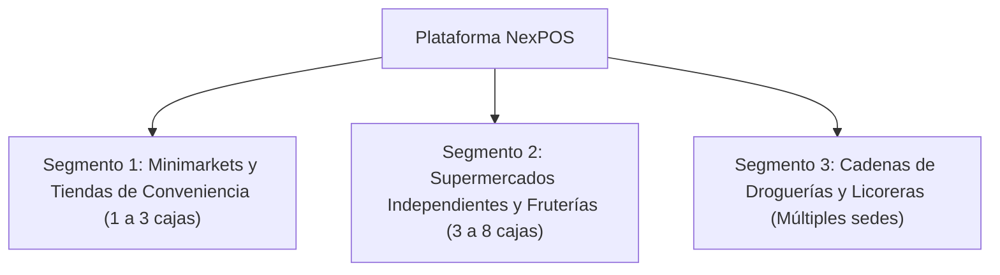
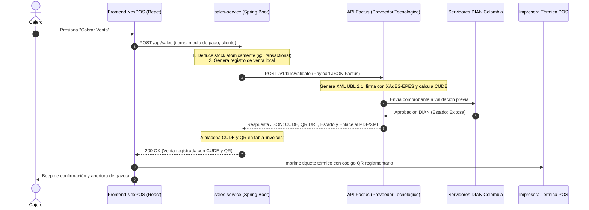
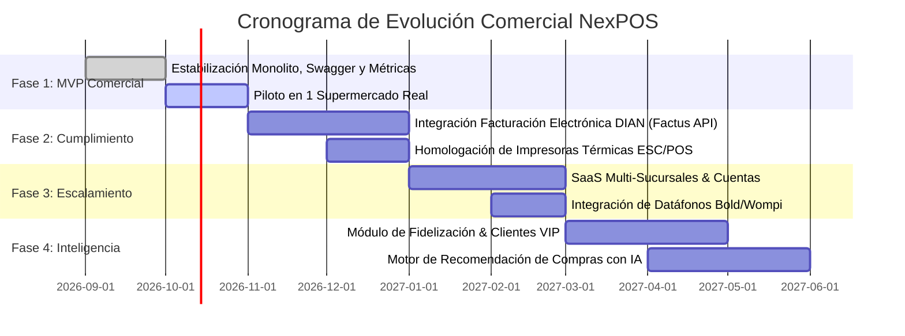

# 🚀 Visión Estratégica, Roadmap Comercial & Propuesta de Valor - NexPOS

Este documento detalla la **visión de negocio, la propuesta de valor real, la estrategia de comercialización y la hoja de ruta técnica** para escalar **NexPOS** desde su estado actual de plataforma operativa hasta convertirse en una solución comercial de clase empresarial (**SaaS Retail POS**) altamente rentable en Colombia y América Latina.

---

## 📑 Tabla de Contenidos

1. [Diagnóstico de Mercado & Propuesta de Valor Real](#1-diagnóstico-de-mercado--propuesta-de-valor-real)
2. [Público Objetivo (Buyer Personas)](#2-público-objetivo-buyer-personas)
3. [Pilares Técnicos para la Comercialización Masiva](#3-pilares-técnicos-para-la-comercialización-masiva)
   - [Pilar A: Facturación Electrónica DIAN (Colombia)](#pilar-a-facturación-electrónica-dian-colombia)
   - [Pilar B: Arquitectura Multitienda (Multi-Tenancy)](#pilar-b-arquitectura-multitienda-multi-tenancy)
   - [Pilar C: Modo Offline-First (Ventas sin Internet)](#pilar-c-modo-offline-first-ventas-sin-internet)
   - [Pilar D: Integración de Datáfonos Inalámbricos](#pilar-d-integración-de-datáfonos-inalámbricos)
   - [Pilar E: Inteligencia Artificial en Compras & Mermas](#pilar-e-inteligencia-artificial-en-compras--mermas)
4. [Hoja de Ruta de Lanzamiento (Fases 1 a 4)](#4-hoja-de-ruta-de-lanzamiento-fases-1-a-4)
5. [Modelo de Negocio & Estrategia de Monetización](#5-modelo-de-negocio--estrategia-de-monetización)
6. [Retorno de Inversión (ROI) para el Supermercado](#6-retorno-de-inversión-roi-para-el-supermercado)

---

## 1. Diagnóstico de Mercado & Propuesta de Valor Real

En el comercio minorista tradicional (supermercados independientes, minimarkets y tiendas de barrio en crecimiento), el **82% de las pérdidas operativas** se deben a tres factores:
1. **Robo hormiga y descuadres de inventario**: Productos que salen del almacén sin registro exacto.
2. **Lentitud en caja registradora**: Filas excesivas en horas pico por sistemas obsoletos que exigen teclear códigos manualmente.
3. **Sanciones tributarias**: Incumplimiento de las normativas de facturación electrónica y expedición de tiquetes equivalentes POS.

### ¿Cómo aporta valor real NexPOS hoy?
*   **Velocidad Extrema de Cobro**: Soporte directo de escáneres de código de barras USB/Bluetooth en modo ráfaga (<50ms por lectura) sin obligar al cajero a enfocar la pantalla.
*   **Aislamiento y Consistencia Transaccional**: Deducción atómica de inventario que impide vender stock fantasma.
*   **Comprobantes Fiscales Inmediatos**: Generación automática de comprobantes en PDF listos para imprimir en impresoras térmicas.
*   **Bajo Costo Total de Propiedad (TCO)**: No requiere servidores costosos locales; funciona en la nube o en equipos sencillos con navegador web.

---

## 2. Público Objetivo (Buyer Personas)

1. **El Dueño o Gerente de Tienda**:
   - *Dolor*: Miedo a que los empleados le roben en turnos nocturnos y falta de tiempo para cuadrar cierres de caja.
   - *Solución*: Panel en tiempo real accesible desde el móvil, cuadre de caja ciego y reportes de rentabilidad por producto.
2. **El Cajero**:
   - *Dolor*: Cansancio visual tras 8 horas de turno y clientes impacientes en la fila.
   - *Solución*: Interfaz ergonómica de alto contraste, retroalimentación sonora positiva (beep) y visor dual (cuadrícula/lista).

---

## 3. Pilares Técnicos para la Comercialización Masiva

### Pilar A: Facturación Electrónica DIAN (Colombia) — Proveedor Designado: Factus

Para comercializarse legalmente a supermercados y comercios en Colombia, el sistema implementará la emisión del **Documento Equivalente Electrónico POS** (Resolución DIAN 000165 de 2023). 

#### 🏆 Proveedor Tecnológico Seleccionado: **Factus** ([factus.com.co](https://factus.com.co))
Tras evaluar alternativas como *The Factory HKA*, *Dataico* y la conexión directa SOAP con la DIAN, se seleccionó a **Factus** como el proveedor oficial por las siguientes razones:
1. **API REST Moderna**: Payloads en formato JSON estándar (evitando la sobrecarga y fragilidad del protocolo SOAP/XML de la DIAN).
2. **Ambiente Sandbox Gratuito**: Permite simular y probar emisiones de facturas electrónicas de prueba de inmediato.
3. **Costo Marginal Altamente Competitivo**: ~$50 a $85 COP por factura emitida, maximizando el margen de ganancia del modelo SaaS.
4. **Validación Previa Inmediata (<1 segundo)**: Vital para cajas de supermercado con clientes esperando en fila.

#### Diagrama de Integración con Factus

#### Requerimientos de Datos a Incorporar:
1. **Configuración de Empresa (`company_config`)**:
   - NIT del comercio, Razón Social, Dirección, Municipio y Régimen tributario (Responsable / No Responsable de IVA).
   - Datos de Resolución DIAN: Prefijo (ej: `POS`), Rango autorizado (ej: `1` a `20.000`), Clave técnica y Fecha de vigencia.
2. **Productos (`productos`)**:
   - Tarifa de IVA (`iva_rate`: 0%, 5%, 19%) y Código estándar de unidad de medida DIAN (`94` para unidades, `KGM` para peso).
3. **Facturas (`invoices`)**:
   - Almacenamiento del `cude`, `qr_data` y estado de validación devuelto por Factus.

#### Proceso de Habilitación para el Supermercado Cliente:
1. Contar con RUT activo con la responsabilidad tributaria `52` (Facturador Electrónico).
2. Ingresar al portal de la DIAN (`catalogo-vpfe.dian.gov.co`) y asociar a **Factus** como su Proveedor Tecnológico Autorizado en modo de operación (proceso guiado de 10 minutos).
3. Solicitar autorización de numeración para Documento Equivalente POS en el sistema Muisca.
4. Ingresar el Token de API de Factus en el panel de configuración de NexPOS.

---

### Pilar B: Arquitectura Multitienda (Multi-Tenancy)
Para operar como un SaaS escalable donde un único despliegue atienda a cientos de supermercados:
*   **Aislamiento Lógico**: Incorporación de un atributo `tenant_id` y `branch_id` en las entidades del sistema (`productos`, `sales`, `usuarios`).
*   **Traslado de Mercancía**: Módulo de transferencias entre bodega central y sucursales satélite con trazabilidad de despacho y recepción.

---

### Pilar C: Modo Offline-First (Ventas sin Internet)
En muchas zonas comerciales los cortes de fluido eléctrico o de conexión a internet paralizan las ventas.
*   **Implementación**:
    *   **IndexedDB en el Navegador**: Almacena el catálogo de productos y precios localmente.
    *   **Service Worker (PWA)**: Permite cargar la pantalla de ventas sin conexión.
    *   **Sincronización en Segundo Plano (Background Sync)**: Las ventas emitidas offline se almacenan en una cola local y se sincronizan atómicamente con el servidor una vez restablecida la red.

---

### Pilar D: Integración de Datáfonos Inalámbricos
*   **Soporte de Terminales Smart**: Integración con APIs/SDKs de proveedores como **Bold**, **Wompi**, **Redeban** o **Credibanco**.
*   **Beneficio**: Al elegir `TARJETA`, el monto se envía automáticamente al datáfono por Bluetooth o Wi-Fi, eliminando el error humano de digitar el valor dos veces.

---

### Pilar E: Inteligencia Artificial en Compras & Mermas
*   **Predicción de Agotamiento de Stock**: Algoritmo que analiza la velocidad de venta diaria y alerta: *"Quedan 5 unidades de Leche Alquería; según su promedio histórico, se agotará en 3 horas"*.
*   **Sugerencia Automática de Pedidos a Proveedor**: Generación con 1 clic de la orden de compra en formato PDF o WhatsApp hacia distribuidores mayoristas.

---

## 4. Hoja de Ruta de Lanzamiento (Fases 1 a 4)

---

## 5. Modelo de Negocio & Estrategia de Monetización

NexPOS puede comercializarse bajo un modelo **SaaS B2B por Suscripción Mensual/Anual**:

| Plan | Tarifa Estimada | Características Incluidas |
| :--- | :--- | :--- |
| **Básico (Minimarket)** | $79.000 COP / mes | 1 Terminal POS, Inventario ilimitado, Facturas PDF, Soporte de escáner. |
| **Profesional (Supermercado)** | $149.000 COP / mes | Hasta 3 Terminales POS, Facturación Electrónica DIAN incluida, Reportes avanzados, Usuarios ilimitados. |
| **Cadenas (Multi-Sucursal)** | $289.000 COP / mes | Múltiples sedes, Bodega central, Traslados de stock, Analítica predictiva, Soporte 24/7. |

*   **Ingresos Adicionales**:
    *   Venta de hardware homologado en combo (Lector de códigos de barras + Impresora térmica + Gaveta de dinero).
    *   Comisión por transacción procesada a través de datáfonos integrados (0.2% - 0.5%).

---

## 6. Retorno de Inversión (ROI) para el Supermercado

Para un supermercado de tamaño medio con ventas mensuales de **$40.000.000 COP**:

*   **Reducción de Mermas por Descontrol de Stock**: Recuperación estimada del 2% al 3% de las ventas brutas (**+$800.000 a $1.200.000 COP/mes**).
*   **Agilidad en Caja (+35% velocidad)**: Capacidad para atender hasta 20 clientes más por hora pico en temporadas festivas.
*   **Eliminación de Errores de Cobro**: El escaneo obligatorio de códigos de barra erradica los cobros manuales equivocados.

> **Conclusión Comercial**: El software se paga por sí mismo en los primeros **15 días de uso**, convirtiéndolo en una propuesta de venta de cierre inmediato para cualquier comerciante minorista.
