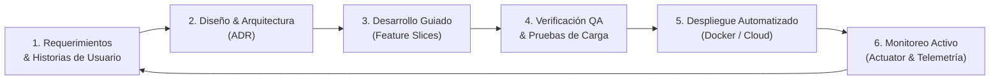
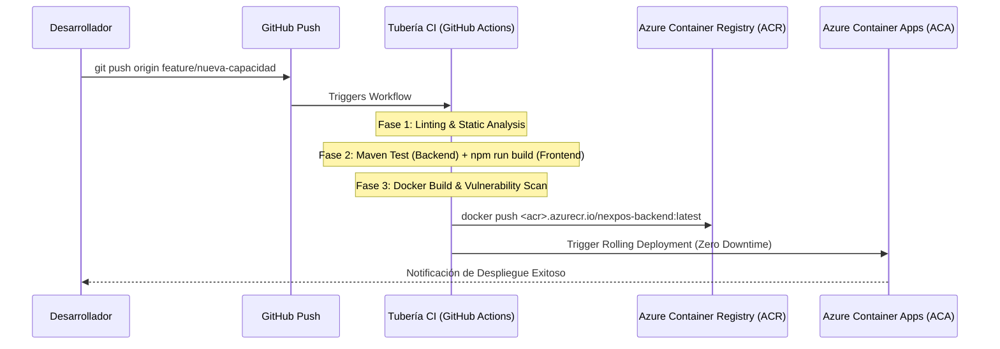

# 📘 Guía Maestra del Ciclo de Vida de Desarrollo de Software (SDLC) - MarketCali

[](https://www.iso.org/standard/63711.html)
[](https://martinfowler.com/)
[](https://github.com/features/actions)

Este documento define la metodología, estándares técnicos, controles de calidad y procesos operativos para todas las fases del ciclo de vida de desarrollo de software (**SDLC - Software Development Life Cycle**) de la plataforma **MarketCali**.

---

## 📑 Tabla de Contenido

1. [Gobernanza del Ciclo de Vida y Metodología](#1-gobernanza-del-ciclo-de-vida-y-metodología)
2. [Arquitectura y Estándares de Diseño de Software](#2-arquitectura-y-estándares-de-diseño-de-software)
3. [Flujo de Trabajo en Control de Versiones (GitFlow)](#3-flujo-de-trabajo-en-control-de-versiones-gitflow)
4. [Estrategia de Evolución y Migración de Base de Datos (Flyway)](#4-estrategia-de-evolución-y-migración-de-base-de-datos-flyway)
5. [Tubería de Integración y Entrega Continua (CI/CD)](#5-tubería-de-integración-y-entrega-continua-cicd)
6. [Estrategia de Aseguramiento de Calidad y Pruebas (QA)](#6-estrategia-de-aseguramiento-de-calidad-y-pruebas-qa)
7. [Seguridad de Aplicación y Cumplimiento (SecOps)](#7-seguridad-de-aplicación-y-cumplimiento-secops)
8. [Observabilidad, Monitoreo y Mantenimiento en Producción](#8-observabilidad-monitoreo-y-mantenimiento-en-producción)

---

## 1. Gobernanza del Ciclo de Vida y Metodología

MarketCali adopta un marco ágil **Scrum/Kanban Híbrido (Scrumban)** con iteraciones de 2 semanas enfocadas en entregables transaccionales de alto valor para el negocio minorista:



### Roles y Responsabilidades
*   **Product Owner / Especialista de Dominio Retail**: Prioriza backlog con base en cuellos de botella de cajeros y directrices tributarias (DIAN).
*   **Tech Lead / Arquitecto**: Supervisa consistencia del modelo relacional, modularidad del monolito y seguridad JWT.
*   **Fullstack Developers**: Implementan funcionalidades respetando el aislamiento de dominios y co-localización de componentes.
*   **DevOps / SRE**: Gestiona contenedores, pipelines de integración continua e infraestructura como código (Terraform).

---

## 2. Arquitectura y Estándares de Diseño de Software

### Backend (Spring Boot 3.2.5 + Java 17)
*   **Patrón Modular Monolith**: Todos los dominios residen en módulos Maven independientes (`auth-service`, `product-service`, `sales-service`) dentro de un único proceso de despliegue (`monolith-app`).
*   **Inmutabilidad y DTOs**: Las entidades JPA (`@Entity`) nunca se exponen directamente a los clientes HTTP. Cada petición y respuesta se canaliza mediante DTOs validados con `jakarta.validation`.
*   **Transaccionalidad Estricta**: Cada checkout en `/api/sales` ejecuta una transacción atómica (`@Transactional`) con nivel de aislamiento por defecto de MySQL (`REPEATABLE READ`), garantizando deducción de inventario consistente ante concurrencia.
*   **Manejo Centralizado de Excepciones**: `@ControllerAdvice` global en `monolith-app.exception` para unificar respuestas de error en un payload estándar:
    ```json
    {
      "timestamp": "2026-09-28T01:50:00",
      "status": 400,
      "message": "Stock insuficiente para el producto: Arroz Diana 1kg"
    }
    ```

### Frontend (React 18 + Vite)
*   **Domain-Driven Component Design**: Componentes organizados por caso de uso en `src/pages/{feature}/` con su respectiva hoja de estilos `.css` co-localizada.
*   **Custom Hooks para Periféricos**: Lógica de hardware (pistolas lectoras de barras HID) desacoplada en `useHardwareScanner.js`.
*   **Seguridad Declarativa**: Control de acceso basado en roles (RBAC) encapsulado en `ProtectedRoute.jsx` y propagado vía `AuthContext`.

---

## 3. Flujo de Trabajo en Control de Versiones (GitFlow)

El desarrollo se gestiona en dos repositorios desacoplados:
*   `nexpos-backend`: Código de los módulos Spring Boot, migraciones Flyway y Dockerfile.
*   `nexpos-frontend`: Aplicación cliente SPA, assets y configuración Nginx.

### Ramas y Convenciones
*   `main` / `master`: Código en estado de producción desplegable.
*   `develop` (o ramas temáticas directas): Integración de funcionalidades.
*   `feature/<nombre>`: Desarrollo de nuevas capacidades (ej: `feature/pos-dual-view`).
*   `hotfix/<nombre>`: Corrección urgente de defectos en producción.

### Formato de Commits (Conventional Commits)
Los commits deben seguir la convención semántica:
```
<tipo>(<ámbito opcional>): <descripción concisa en minúsculas>

[cuerpo explicativo opcional]
```
Tipos admitidos: `feat`, `fix`, `refactor`, `style`, `docs`, `test`, `chore`.

---

## 4. Estrategia de Evolución y Migración de Base de Datos (Flyway)

Para garantizar cero discrepancias de esquema entre desarrollo, pruebas y producción, la base de datos se versiona con **Flyway**:

```
monolith-app/src/main/resources/db/migration/
├── V1__initial_schema.sql            # Creación inicial de tablas e integridad referencial
└── V2__add_performance_indexes.sql   # Índices para lectores de barras y rangos de fecha
```

### Reglas de Oro en Migraciones:
1. **Scripts Inmutables**: Una vez que un archivo `V<N>__*.sql` ha sido aplicado en cualquier entorno, **nunca se modifica**. Las correcciones se realizan en una nueva versión (`V3__...`).
2. **Idempotencia**: Usar cláusulas defensivas (`CREATE TABLE IF NOT EXISTS`, `CREATE INDEX IF NOT EXISTS`).
3. **Validación Automática**: En producción, `spring.jpa.hibernate.ddl-auto` se configura en `validate` para asegurar que el código Java coincida exactamente con la base de datos migrada por Flyway.

---

## 5. Tubería de Integración y Entrega Continua (CI/CD)

Flujo automatizado implementable mediante GitHub Actions (`.github/workflows/ci.yml`):



---

## 6. Estrategia de Aseguramiento de Calidad y Pruebas (QA)

| Tipo de Prueba | Herramienta | Alcance |
| :--- | :--- | :--- |
| **Pruebas Unitarias** | JUnit 5 + Mockito | Lógica de cálculo de precios, impuestos, deducción de stock y validación de DTOs. |
| **Pruebas de Integración** | Spring Boot Test + Testcontainers | Validación de repositorios JPA contra una instancia real de base de datos MySQL efímera. |
| **Pruebas de Componentes UI** | Vite Build + React Testing Library | Verificación de renderizado de vistas, cálculo de cambio y modales de escaneo. |
| **Pruebas de Carga POS** | Apache JMeter / k6 | Simulación de 50 cajeros concurrentes realizando escaneo de códigos de barra simultáneos (<100ms P95). |

---

## 7. Seguridad de Aplicación y Cumplimiento (SecOps)

1. **Gestión Criptográfica de Tokens**:
   - Firmado simétrico HMAC-SHA256 con expiración de 24 horas (`JWT_EXPIRATION: 86400000`).
   - Rotación periódica de `JWT_SECRET` mediante inyección de secretos externos.
2. **Protección de Datos Sensibles**:
   - Hashing con sal dinámico (`BCryptPasswordEncoder` costo 10) para todas las credenciales de usuarios.
   - Headers de seguridad configurados en Nginx (`X-Content-Type-Options: nosniff`, `X-Frame-Options: SAMEORIGIN`).
3. **Sanitización de Entradas**:
   - Validación tipada estricta para evitar inyecciones SQL (uso exclusivo de parámetros nombrados en Spring Data JPA).

---

## 8. Observabilidad, Monitoreo y Mantenimiento en Producción

### Endpoints de Salud y Diagnóstico
*   **Actuator Health**: `http://localhost:8088/actuator/health` (Reporta estado de la conexión a la base de datos MySQL, disco y memoria).
*   **Documentación Swagger Viva**: `http://localhost:8088/swagger-ui.html` (Exploración interactiva de contratos REST y esquemas de payload).
*   **Métricas del Sistema**: `http://localhost:8088/actuator/metrics` (Telemetría de tiempo de respuesta HTTP y pool de conexiones HikariCP).

### Política de Copias de Seguridad (Backup & Recovery)
*   **Frecuencia**: Volcado diario automatizado con `mysqldump` a las 02:00 AM (hora de baja actividad).
*   **Retención**: 30 días en almacenamiento redundante frío (Azure Blob Storage / AWS S3).
*   **RTO (Recovery Time Objective)**: Menor a 30 minutos.
*   **RPO (Recovery Point Objective)**: Menor a 24 horas (o 0 horas con replicación continua habilitada).
